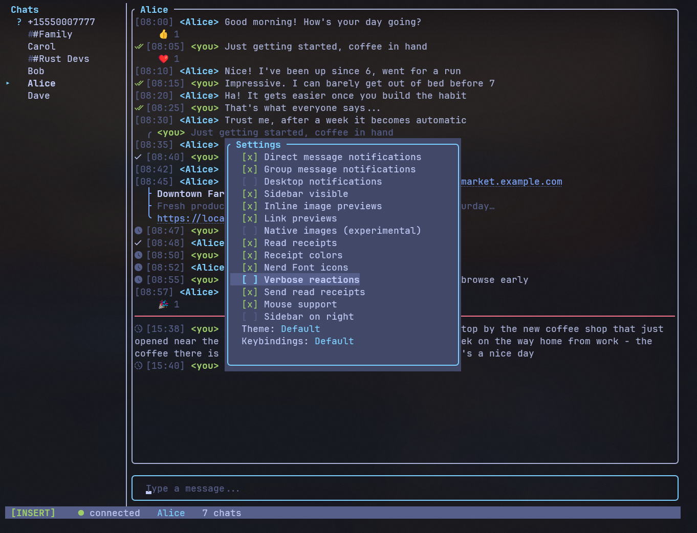

# Configuration

## Config file location

siggy loads its config from a TOML file at the platform-specific path:

| Platform | Path |
|---|---|
| Linux / macOS | `~/.config/siggy/config.toml` |
| Windows | `%APPDATA%\siggy\config.toml` |

You can override the path with the `-c` flag:

```sh
siggy -c /path/to/config.toml
```

## Config fields

All fields are optional. Here is a complete example with defaults:

```toml
account = "+15551234567"
signal_cli_path = "signal-cli"
download_dir = "/home/user/signal-downloads"
notify_direct = true
notify_group = true
desktop_notifications = false
notification_preview = "full"
clipboard_clear_seconds = 30
inline_images = true
show_link_previews = true
native_images = false
date_separators = true
show_receipts = true
color_receipts = true
nerd_fonts = false
emoji_to_text = false
show_reactions = true
reaction_verbose = false
send_read_receipts = true
mouse_enabled = true
sidebar_on_right = false
theme = "Default"
keybinding_profile = "Default"
settings_profile = "Default"
proxy = ""
```

### Field reference

| Field | Type | Default | Description |
|---|---|---|---|
| `account` | string | `""` | Phone number in E.164 format |
| `signal_cli_path` | string | `"signal-cli"` | Path to the signal-cli binary |
| `download_dir` | string | `~/signal-downloads/` | Directory for downloaded attachments |
| `notify_direct` | bool | `true` | Terminal bell on new direct messages |
| `notify_group` | bool | `true` | Terminal bell on new group messages |
| `desktop_notifications` | bool | `false` | OS-level desktop notifications for incoming messages |
| `notification_preview` | string | `"full"` | Notification content level: `full`, `sender`, or `minimal` |
| `clipboard_clear_seconds` | int | `30` | Seconds before clipboard auto-clears after copying (0 = disabled) |
| `inline_images` | bool | `true` | Render image attachments as halfblock art |
| `show_link_previews` | bool | `true` | Show link preview cards for URLs in messages |
| `native_images` | bool | `false` | Use native terminal image protocols (Kitty/iTerm2) |
| `date_separators` | bool | `true` | Show date separator lines between messages from different days |
| `show_receipts` | bool | `true` | Show delivery/read receipt status symbols |
| `color_receipts` | bool | `true` | Colored receipt status symbols (vs monochrome) |
| `nerd_fonts` | bool | `false` | Use Nerd Font glyphs for status symbols |
| `emoji_to_text` | bool | `false` | Convert emoji to text emoticons/shortcodes |
| `show_reactions` | bool | `true` | Show emoji reactions on messages |
| `reaction_verbose` | bool | `false` | Show reaction sender names instead of counts |
| `send_read_receipts` | bool | `true` | Send read receipts when viewing conversations |
| `mouse_enabled` | bool | `true` | Enable mouse support (click sidebar, scroll, etc.) |
| `sidebar_on_right` | bool | `false` | Display sidebar on the right side instead of left |
| `theme` | string | `"Default"` | Color theme name |
| `keybinding_profile` | string | `"Default"` | Keybinding profile (`Default`, `Emacs`, `Minimal`, or custom) |
| `settings_profile` | string | `"Default"` | Settings profile preset (`Default`, `Minimal`, `Full`, or custom) |
| `proxy` | string | `""` | Signal TLS proxy URL passed through to signal-cli |

## CLI flags

CLI flags override config file values for the current session:

| Flag | Overrides |
|---|---|
| `-a +15551234567` | `account` |
| `-c /path/to/config.toml` | Config file path |
| `--incognito` | Uses in-memory database (no persistence) |

## Settings overlay



Press `/settings` inside the app to open the settings overlay. This provides
toggles for runtime settings:

- Notification toggles (direct / group / desktop)
- Notification preview level
- Sidebar visibility / position
- Inline image previews / link previews / native images
- Date separators
- Show read receipts / receipt colors / nerd font icons
- Emoji-to-text mode
- Show reactions / verbose reactions
- Send read receipts
- Mouse support
- Theme selector
- Keybinding profile selector
- Settings profile selector

Changes made in the settings overlay are saved to the config file when you
close the overlay, and persist across sessions.

## Settings profiles

Settings profiles are presets that configure all display toggles at once.
Three built-in profiles are included:

| Profile | Description |
|---|---|
| **Default** | Balanced defaults for most users |
| **Minimal** | IRC-style stripped back UI - disables images, previews, receipts, notifications, date separators |
| **Full** | Everything enabled |

In the settings overlay, use `h`/`l` on the Profile row to cycle through
profiles, or press Enter to open the profile management overlay where you can:

- **Load** a profile (Enter) - applies all toggles and previews the result
- **Save as** (S) - save your current settings as a new custom profile
- **Save** (s) - overwrite a custom profile with current settings
- **Delete** (d) - remove a custom profile

Custom profiles are stored as TOML files in `~/.config/siggy/profiles/`.
Built-in profiles cannot be modified or deleted.

## Incognito mode

```sh
siggy --incognito
```

Incognito mode replaces the on-disk SQLite database with an in-memory database.
No messages, conversations, or read markers are saved. When you exit, all data is
gone. The status bar shows a bold magenta **incognito** indicator.
