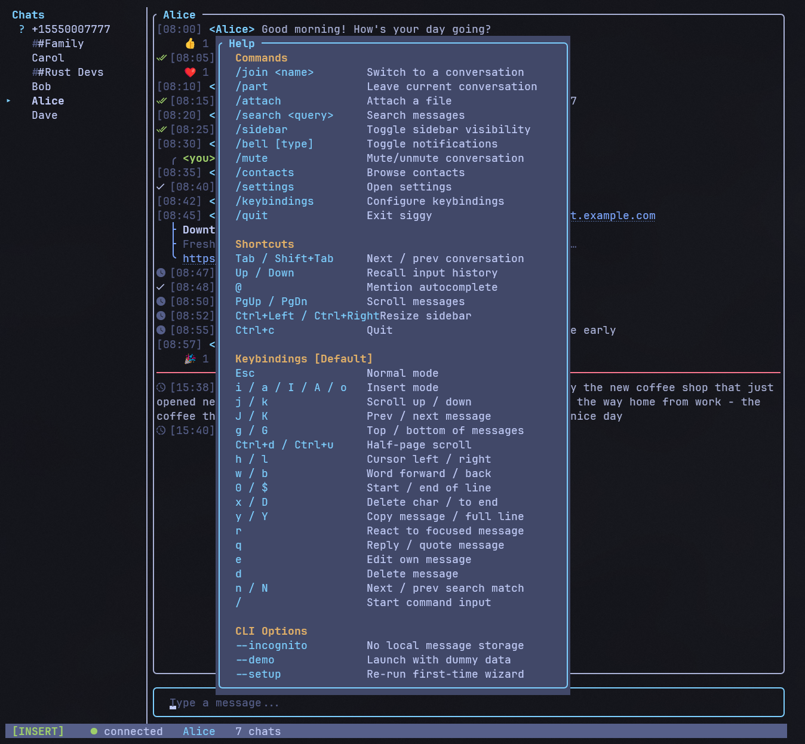

# Keybindings

siggy uses vim-style modal editing with two modes: **Insert** (default) and
**Normal**. All keybindings are configurable via profiles and per-key overrides.

## Profiles

Three built-in profiles are available:

| Profile | Description |
|---|---|
| **Default** | Vim-style modal editing (Normal / Insert modes) |
| **Emacs** | No modal concept; Ctrl-based shortcuts in Insert mode |
| **Minimal** | Arrow-key centric; F-key shortcuts for actions |

Set the profile in your config file:

```toml
keybinding_profile = "Default"
```

Or switch profiles live in the app via `/keybindings` or `/settings` > Keybindings.

## Customizing keybindings

### Per-key overrides

Create `~/.config/siggy/keybindings.toml` to override individual keys on top
of your active profile:

```toml
[global]
quit = "ctrl+q"

[normal]
scroll_up = "ctrl+j"
react = "ctrl+r"

[insert]
send_message = "ctrl+enter"
```

### Custom profiles

Create full profiles in `~/.config/siggy/keybindings/myprofile.toml`:

```toml
name = "My Custom"

[global]
quit = "ctrl+c"
next_conversation = "tab"

[normal]
scroll_up = "k"
scroll_down = "j"

[insert]
exit_insert = "esc"
send_message = "enter"
insert_newline = ["shift+enter", "alt+enter"]
```

Arrays are supported for binding multiple keys to the same action.

### In-app rebinding

Open the keybindings overlay with `/keybindings` (alias `/kb`). Navigate
actions with `j`/`k`, press Enter to capture a new key, Backspace to reset
to profile default. Changes are saved automatically.

## Default keybindings

The tables below show the Default profile bindings.

## Global (both modes)

| Key | Action |
|---|---|
| `Ctrl+C` | Quit |
| `Tab` / `Shift+Tab` | Next / previous conversation |
| `PgUp` / `PgDn` | Scroll messages (5 lines) |
| `Ctrl+Left` / `Ctrl+Right` | Resize sidebar |

## Normal mode

Press `Esc` to enter Normal mode. The cursor stops blinking and the mode indicator
changes in the status bar.

### Scrolling

| Key | Action |
|---|---|
| `j` / `k` | Scroll down / up 1 line |
| `J` / `K` | Jump to previous / next message |
| `Ctrl+D` / `Ctrl+U` | Scroll down / up half page |
| `g` / `G` | Scroll to top / bottom |

### Actions

| Key | Action |
|---|---|
| `y` | Copy message body to clipboard |
| `Y` | Copy full line (`[HH:MM] <sender> body`) to clipboard |
| `Enter` | Open action menu on focused message |
| `r` | Open reaction picker on focused message |
| `q` | Reply to focused message (quote reply) |
| `e` | Edit own outgoing message |
| `f` | Forward focused message |
| `d` | Delete focused message |
| `p` | Pin / unpin focused message |
| `s` | Filter sidebar conversations |
| `Q` | Jump to quoted message |
| `Ctrl+O` | Jump back to previous position |
| `n` | Jump to next search result |
| `N` | Jump to previous search result |
| `@` | Mention autocomplete (in Insert mode) |

### Cursor movement

| Key | Action |
|---|---|
| `h` / `l` | Move cursor left / right |
| `w` / `b` | Word forward / back |
| `0` / `$` | Start / end of line |

### Editing

| Key | Action |
|---|---|
| `x` | Delete character at cursor |
| `D` | Delete from cursor to end of line |

### Entering Insert mode

| Key | Action |
|---|---|
| `i` | Insert at cursor |
| `a` | Insert after cursor |
| `I` | Insert at start of line |
| `A` | Insert at end of line |
| `o` | Insert (clear buffer first) |
| `/` | Insert with `/` pre-typed (for commands) |

## Insert mode (default)

Insert mode is the default on startup. You can type messages and commands directly.

| Key | Action |
|---|---|
| `Esc` | Switch to Normal mode |
| `Enter` | Send message or execute command |
| `Alt+Enter` / `Shift+Enter` | Insert newline (multi-line input) |
| `Ctrl+W` | Delete word back |
| `Backspace` / `Delete` | Delete characters |
| `Up` / `Down` | Recall input history |
| `Left` / `Right` | Move cursor |
| `Home` / `End` | Jump to start / end of line |

## Mouse

Mouse support is enabled by default (toggle in `/settings`).

| Action | Effect |
|---|---|
| Click sidebar conversation | Switch to that conversation |
| Scroll wheel in chat | Scroll messages up/down |
| Click in input bar | Position cursor |
| Scroll wheel in overlays | Navigate list items |

## Help overlay



Press `/help` (alias `/h`) to see all keybindings and commands at a glance.
The help overlay dynamically reflects your active keybinding profile.

## Input history

In Insert mode, press `Up` and `Down` to cycle through previously sent messages
and commands. History is per-session (not persisted to disk). Your current draft
is preserved while browsing history.
